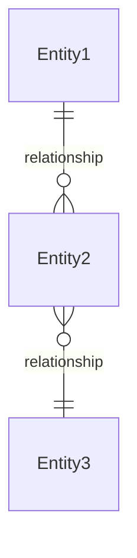
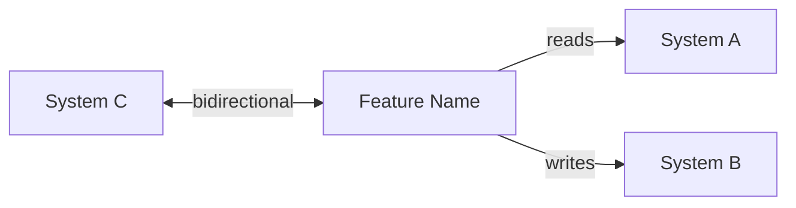

# {Feature Name} — Software Design Document

## Intention

{2-3 sentences describing what the feature does, who uses it, and the business outcome. Focus on the "what" and "why", not the "how".}

{Example: The Planner creates or edits the theoretical hours plan for their team within a flexible period (weekly, biweekly, or monthly). It details expected hours per resource, project, and concept, distinguishing between billable and non-billable.}

## Use Cases

Detailed scenarios in [use-cases.md](./USE_CASES_TEMPLATE.md).

| Use Case | Description | User Stories |
|----------|-------------|-------------|
| [UC-01 — {Title}](./use-cases.md#uc-01--use-case-title-us-01) | {e.g., "Planner creates or edits a capacity plan for a selected period"} | US-01 |
| [UC-02 — {Title}](./use-cases.md#uc-02--use-case-title-us-02-us-03) | {e.g., "Planner publishes a plan, generating an immutable versioned snapshot"} | US-02, US-03 |

---

## Requirements

Functional and non-functional requirements derived from user stories and use cases. Each requirement references the user stories it satisfies and the business rules it enforces.

### Functional Requirements

| ID | Requirement | User Stories | Business Rules |
|----|-------------|-------------|----------------|
| REQ-001 | {What the system must do — e.g., "Display a planning grid with rows per resource and columns per week within the selected period"} | US-01 | — |
| REQ-002 | {e.g., "Preload approved leaves and holidays from HR system, automatically reducing available capacity"} | US-01 | RN-002 |
| REQ-003 | {e.g., "Validate in real time that total allocation per resource does not exceed available capacity"} | US-01, US-02 | RN-003, RN-004 |
| REQ-004 | {e.g., "Generate an immutable snapshot when a plan is published, preserving the previous version"} | US-03 | RN-005 |
| REQ-005 | {e.g., "Support flexible planning periods: weekly, biweekly, or monthly"} | US-01 | RN-006 |

### Non-Functional Requirements

| ID | Category | Requirement |
|----|----------|-------------|
| NFR-01 | Performance | {e.g., "Grid must render 50+ rows with real-time validation under 200ms"} |
| NFR-02 | Security | {e.g., "Only users with Planner role can create or edit plans"} |
| NFR-03 | Availability | {e.g., "Feature must be available during business hours with 99.5% uptime"} |

---

## Business Rules

Constraints that govern system behavior. Referenced by requirements and verified by test cases.

| Rule | Description |
|------|-------------|
| RN-001 | {e.g., "The plan distinguishes: Planned Capacity (total), Billable Capacity, Non-Billable Capacity (Bench, Training, Events)"} |
| RN-002 | {e.g., "Approved leaves from HR system automatically reduce available capacity"} |
| RN-003 | {e.g., "Priority rule: non-billable is assigned first; billable fills the rest"} |
| RN-004 | {e.g., "If non-billable exceeds available hours, billable is set to zero"} |
| RN-005 | {e.g., "Changes to a published plan generate a new version; previous versions are immutable"} |
| RN-006 | {e.g., "Planning period is flexible: weekly, biweekly, or monthly — not monthly only"} |

---

## Test Cases

Test cases mapped to requirements and business rules. Each test case verifies one or more acceptance criteria using Given/When/Then format.

### TC-001 — {Test title} (REQ-001)

**Given** {precondition — e.g., "a Planner with an active team of 10 resources"}
**When** {action — e.g., "the Planner selects a biweekly period and opens the planning grid"}
**Then** {expected result — e.g., "the grid displays 10 rows (one per resource) with columns for each week in the period"}

### TC-002 — {Test title} (REQ-002, RN-002)

**Given** {precondition — e.g., "a resource with 3 approved leave days in the selected period"}
**When** {action — e.g., "the planning grid loads"}
**Then** {expected result — e.g., "available capacity for that resource is reduced by 24 hours (3 days x 8 hours)"}

### TC-003 — {Test title} (REQ-003, RN-003, RN-004)

**Given** {precondition — e.g., "a resource with 40 available hours and 45 hours of non-billable allocation"}
**When** {action — e.g., "the system calculates capacity"}
**Then** {expected result — e.g., "non-billable is set to 40 hours, billable is set to zero, and a capacity exceeded alert is shown"}

### TC-004 — {Test title} (REQ-004, RN-005)

**Given** {precondition — e.g., "a published plan for March 2026"}
**When** {action — e.g., "the Planner edits and publishes a modified version"}
**Then** {expected result — e.g., "a new version is created; the previous version remains accessible and immutable"}

### TC-005 — {Test title} (REQ-003, NFR-01)

**Given** {precondition — e.g., "a grid with 50+ resources and real-time validation enabled"}
**When** {action — e.g., "the Planner modifies an allocation value"}
**Then** {expected result — e.g., "validation feedback appears within 200ms without page reload"}

---

## UX/UI

{Figma links, wireframes, screenshots, or design references.}

{If not available yet, state: "Design references pending — screenshots of production environment will be used as guide."}

---

## Architecture

Technical architecture constraints, data model, API contracts, and service integrations that shape the implementation.

### Architecture Decision Records

Reference the project-level ADRs that constrain this feature's implementation. ADRs are created during the [Discovery phase](../../phases/prepare/architecture-decision-records.md) and live in `docs/adr/`.

| ADR | Title | Impact on this feature |
|-----|-------|----------------------|
| {ADR-NNN} | {Decision title} | {How this ADR constrains or shapes the feature — e.g., "Mandates client-side state management for real-time grid interactions"} |
| {ADR-NNN} | {Decision title} | {Impact description} |

### Tradeoffs

Key tradeoffs accepted in this design. Making these explicit helps future team members (human or agent) understand what was deliberately sacrificed and why.

| Tradeoff | We chose | Over | Rationale |
|----------|----------|------|-----------|
| {e.g., "Consistency vs. Latency"} | {What was prioritized — e.g., "Eventual consistency"} | {What was sacrificed — e.g., "Strong consistency"} | {Why — e.g., "Single-user editing makes conflicts rare; UX responsiveness is the priority"} |
| {e.g., "Simplicity vs. Flexibility"} | {What was prioritized} | {What was sacrificed} | {Why} |

### Performance Goals & Metrics

Target performance benchmarks that the implementation must meet. These serve as gate criteria during verification.

| Metric | Target | Measurement |
|--------|--------|-------------|
| {e.g., "Page load time"} | {e.g., "< 2s on 3G"} | {How it's measured — e.g., "Lighthouse performance audit"} |
| {e.g., "API response time (p95)"} | {e.g., "< 300ms"} | {e.g., "Load test with k6 at 100 concurrent users"} |
| {e.g., "Grid render time"} | {e.g., "< 200ms for 50+ rows"} | {e.g., "Browser performance profiling"} |
| {e.g., "Build size impact"} | {e.g., "< 50KB gzipped delta"} | {e.g., "Bundle analyzer comparison before/after"} |

### Data Model

{Key entities, relationships, and constraints relevant to this feature. Include domain model diagram if applicable.}

| Entity | Key Fields | Notes |
|--------|-----------|-------|
| {Entity1} | {field1, field2, ...} | {Constraints or notes} |
| {Entity2} | {field1, field2, ...} | {Constraints or notes} |

### API / Data Contracts

{Swagger reference, endpoint contracts, or data contract definitions.}

| Endpoint / Contract | Method | Description |
|---------------------|--------|-------------|
| `/api/v1/resource` | GET / POST | {What this endpoint does — e.g., "Returns paginated list of plans for the selected period"} |
| `/api/v1/resource/:id` | GET / PUT / DELETE | {What this endpoint does — e.g., "Retrieves, updates, or deletes a specific plan"} |

{If not defined yet, state: "API contracts to be defined during planning phase."}

### Service Integrations

| System | Direction | Data |
|--------|-----------|------|
| {System Name} | Reading | {What data is consumed — e.g., "Approved leaves, holidays, non-working days"} |
| {System Name} | Writing | {What data is sent — e.g., "Published plan snapshots"} |
| {System Name} | Bidirectional | {What data flows both ways} |

